# 🍔 Hungry App

## 📱 About The Project

**Hungry App** is a modern food ordering mobile application built with **Flutter**.

The application provides a complete food ordering experience, allowing users to browse available products, explore product details, customize their meals, add items to the cart, and proceed through the checkout process.

The project was developed with a strong focus on **clean code, scalability, maintainability, and separation of concerns**. It follows **Clean Architecture** principles and uses **BLoC/Cubit** for predictable and scalable state management.

### ✨ Key Features

* 🔐 User authentication
* 🏠 Browse food products and categories
* 🔎 Explore product details
* 🧀 Customize meals with toppings and side options
* 🛒 Add and manage items in the cart
* 💳 Checkout flow
* 📦 Order management
* 🔥 Firebase integration
* 📱 Responsive Flutter UI

### 🏗️ Architecture

The project follows **Clean Architecture** to keep the application maintainable and scalable by separating business logic from UI and data sources.

```text
Presentation
     ↓
   Domain
     ↓
    Data
```

The main layers are:

* **Presentation** — UI, Cubits, and state management
* **Domain** — Entities, repositories, and use cases
* **Data** — Models, data sources, and repository implementations

### 🛠️ Technologies & Tools

* **Flutter**
* **Dart**
* **BLoC / Cubit**
* **Clean Architecture**
* **Firebase**
* **Cloud Firestore**
* **Firebase Authentication**
* **Repository Pattern**
* **Dependency Injection**
* **GoRouter**

## 🎯 Project Goal

The main goal of this project was to build a real-world Flutter application while applying professional software development practices, including scalable architecture, state management, Firebase integration, reusable components, and separation of concerns.


## 📸 Screenshots

### 🚀 Getting Started

<p align="center">
  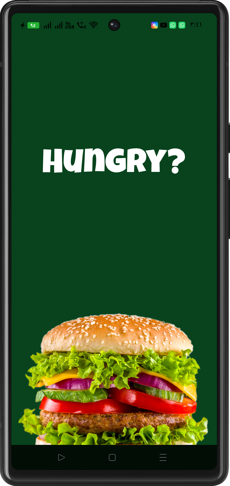
</p>

### 🔐 Authentication

<p align="center">
  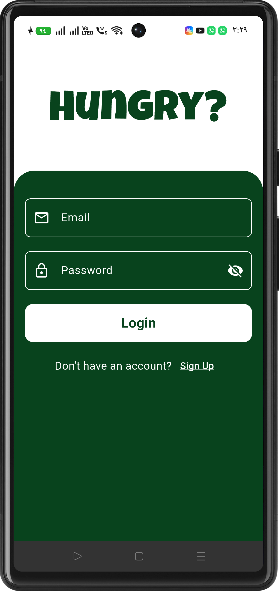
  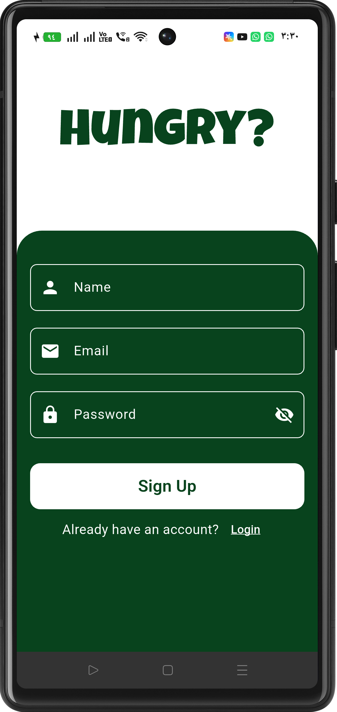
</p>

### 🏠 Home & Discovery

<p align="center">
  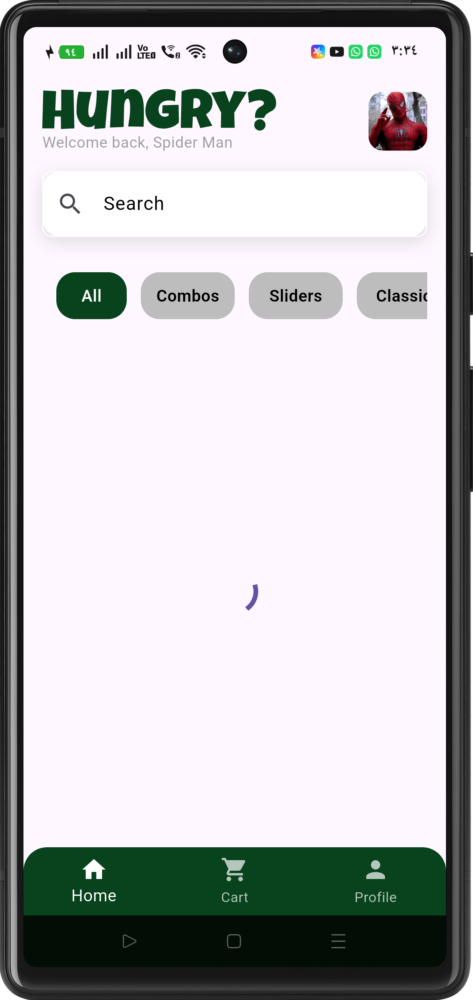
  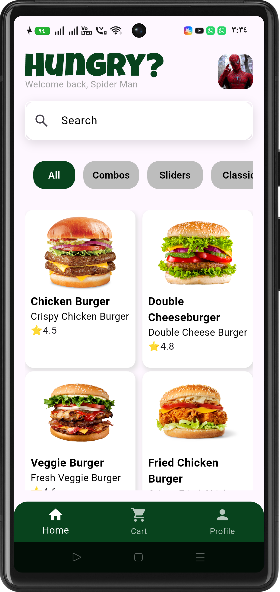
  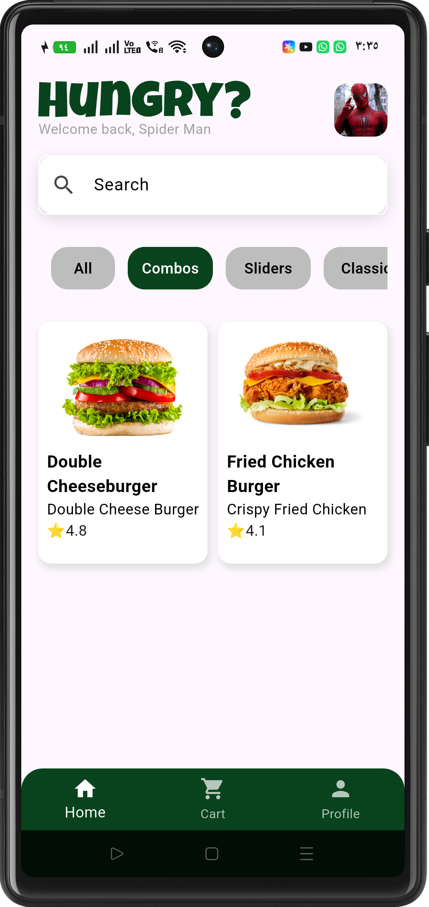
</p>

### 🍔 Product Details

<p align="center">
  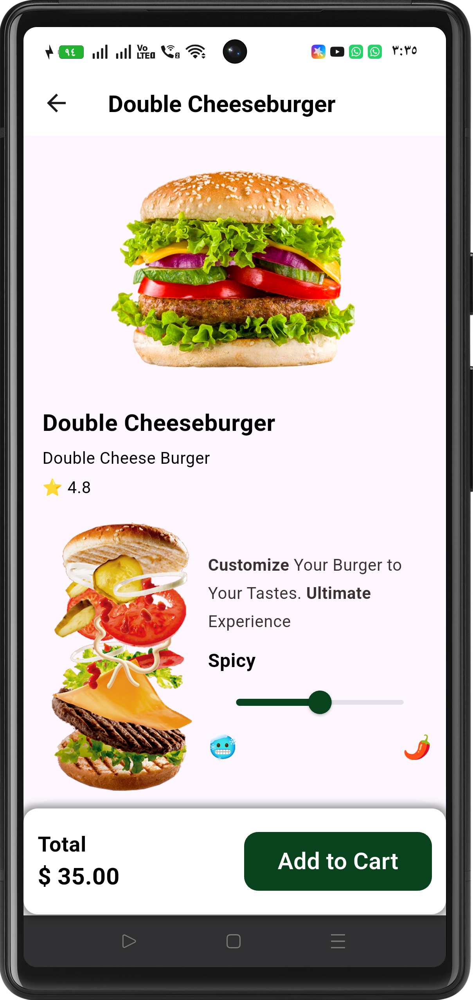
  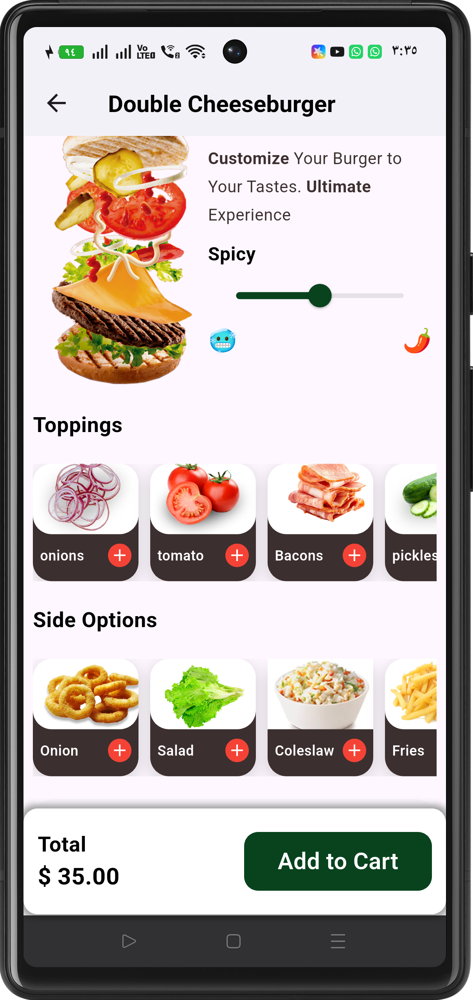
</p>

### 🛒 Cart & Checkout

<p align="center">
  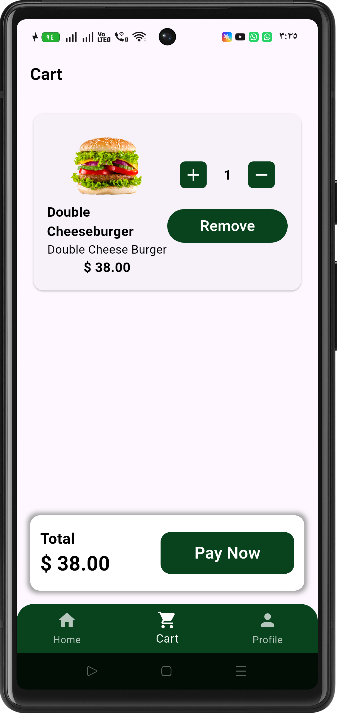
  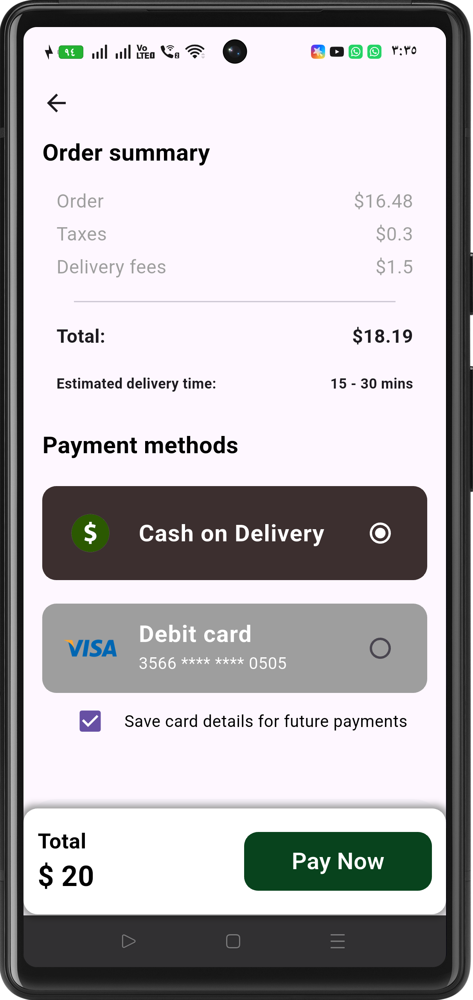
  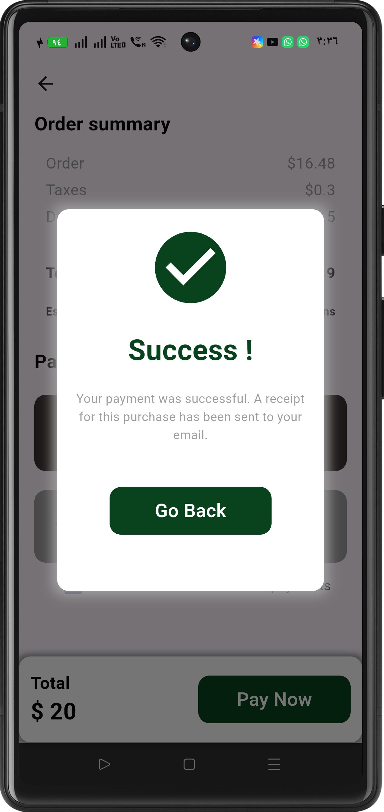
</p>

### 👤 Profile

<p align="center">
  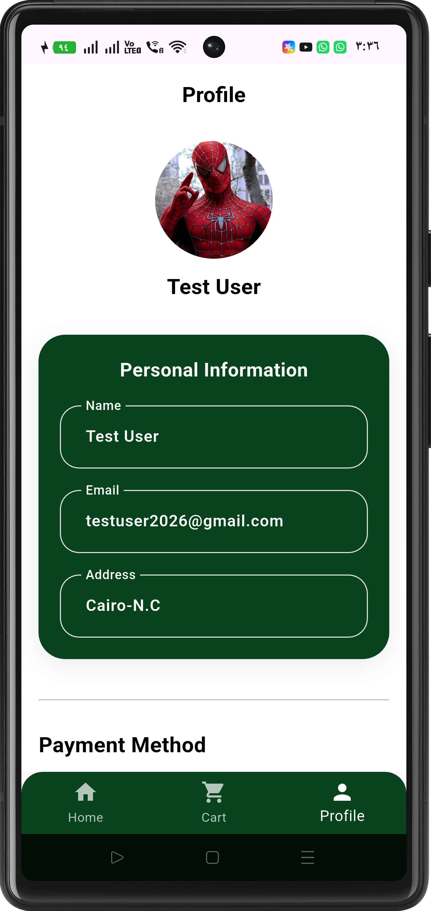
  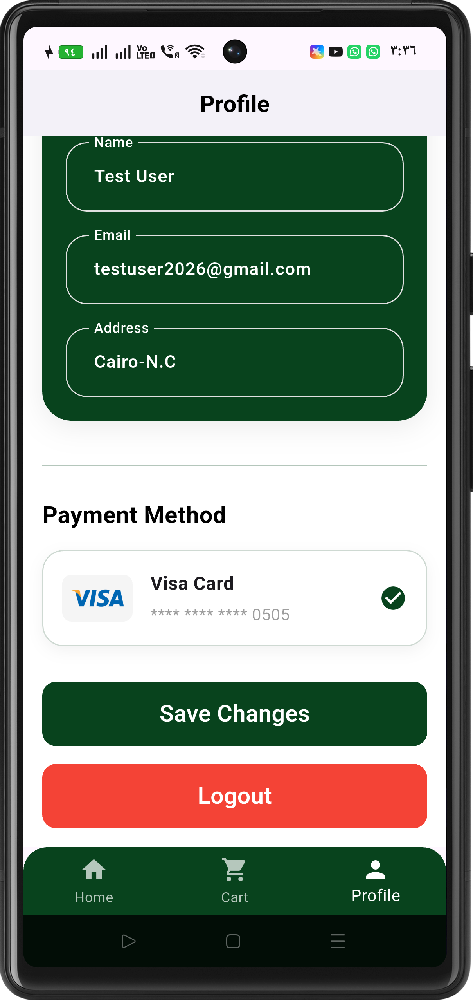
</p>
